# Employee Certificate Request App

A React Native mobile application that allows employees to request, track, and preview certificates of employment.

## Screenshots

### Android — Light Theme

|                      Requests List                       |                      New Request                      |                        Request Details                        |                  Certificate Preview                   |
| :------------------------------------------------------: | :---------------------------------------------------: | :-----------------------------------------------------------: | :----------------------------------------------------: |
| 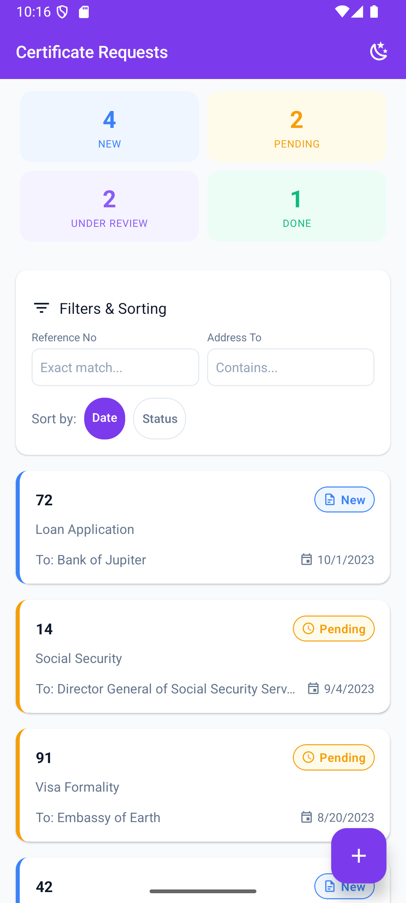 | 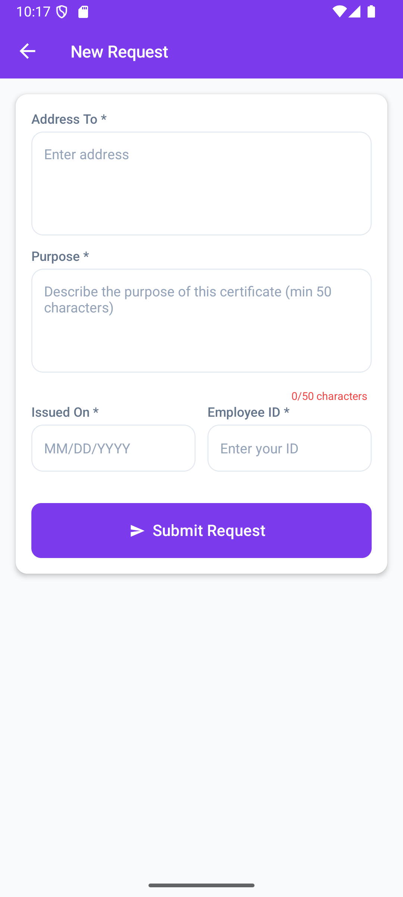 | 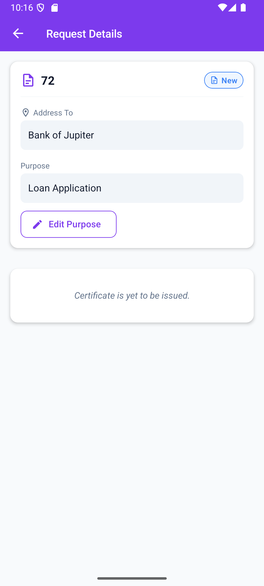 | 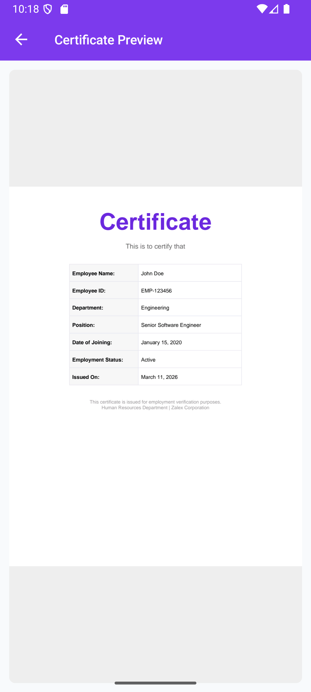 |

|                      Details with Certificate                      |                   Success Modal                    |
| :----------------------------------------------------------------: | :------------------------------------------------: |
| 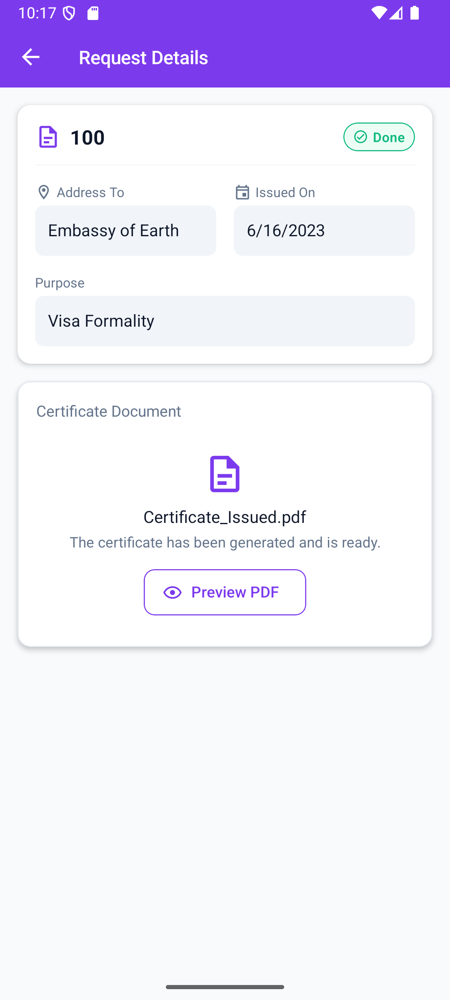 | 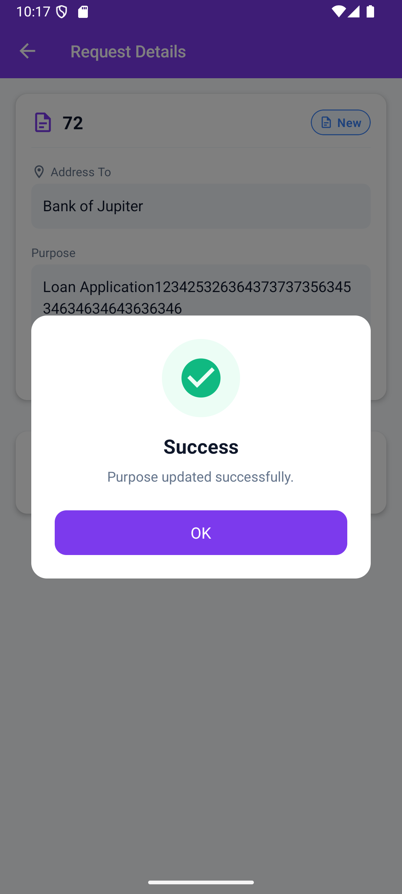 |

### Android — Dark Theme

|                  Requests List                  |                     New Request                      |                       Request Details                        |                  Certificate Preview                  |
| :---------------------------------------------: | :--------------------------------------------------: | :----------------------------------------------------------: | :---------------------------------------------------: |
| 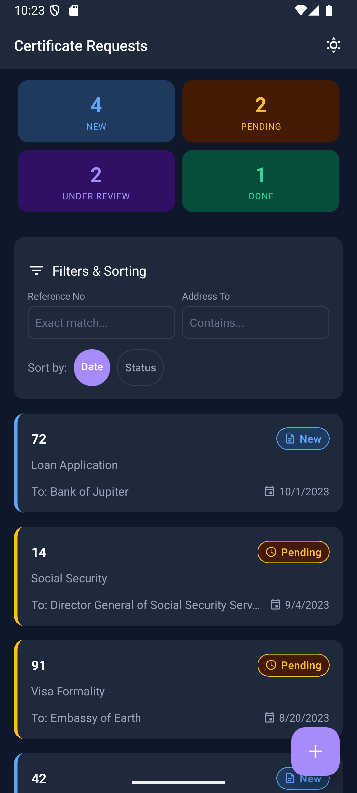 | 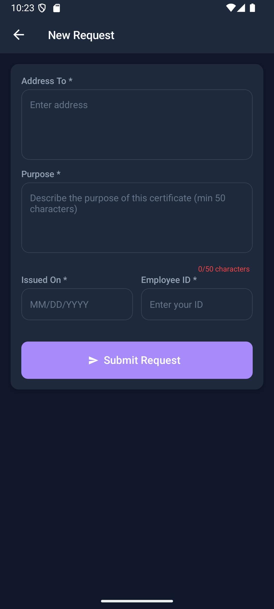 | 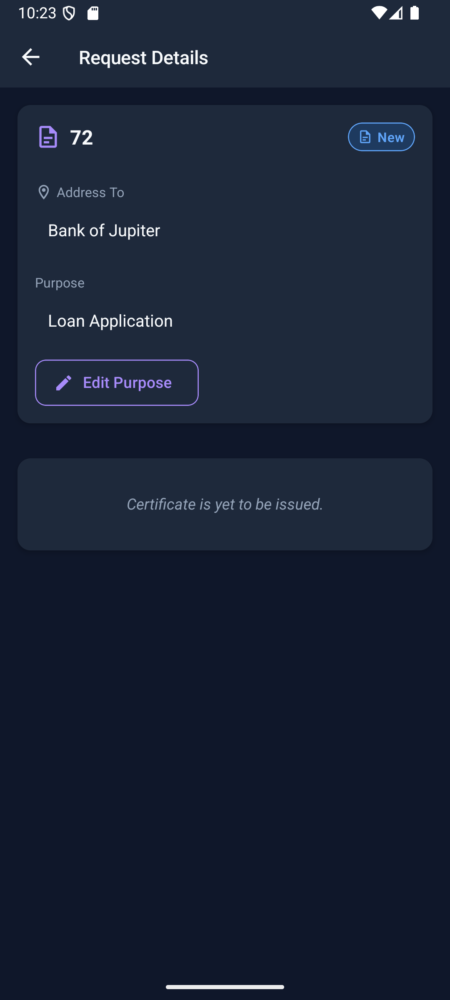 | 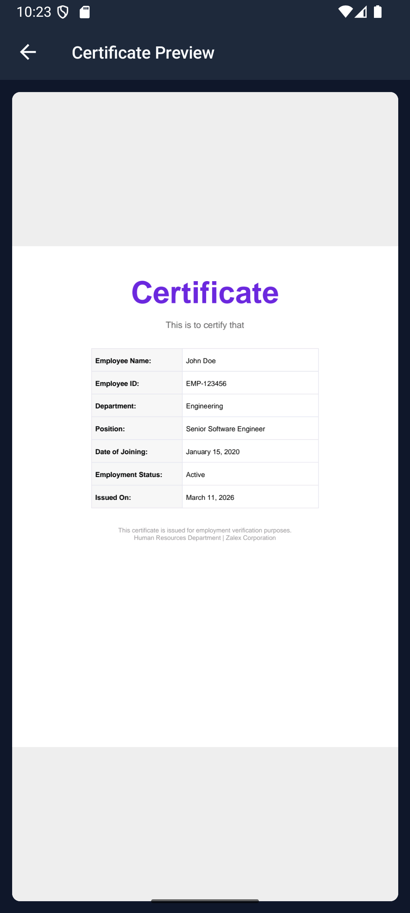 |

|                     Details with Certificate                      |
| :---------------------------------------------------------------: |
| 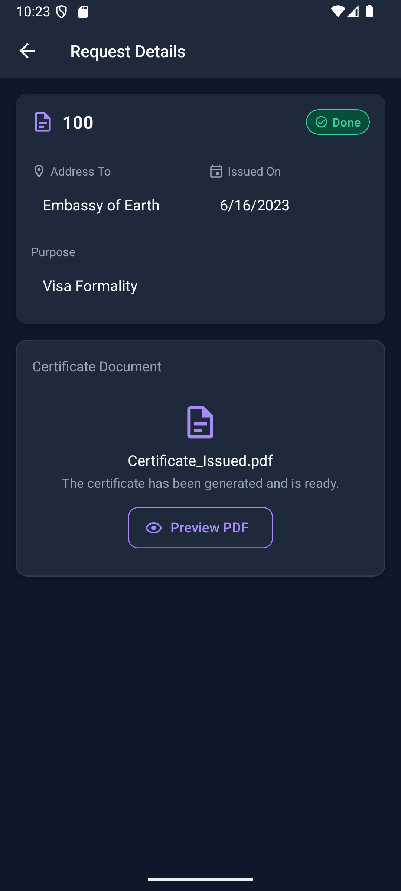 |

### iOS — Light Theme

|                    Requests List                    |                    New Request                    |                  Request Details                   |                    PDF Preview                    |
| :-------------------------------------------------: | :-----------------------------------------------: | :------------------------------------------------: | :-----------------------------------------------: |
| 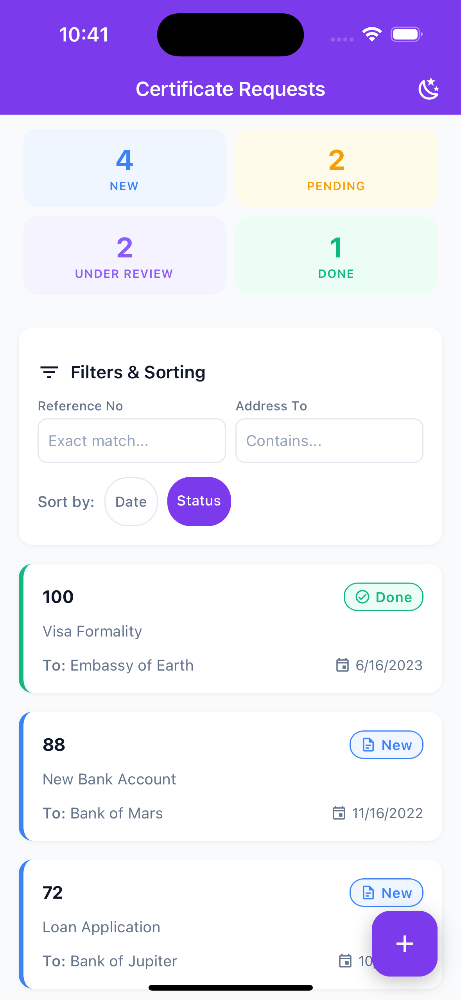 | 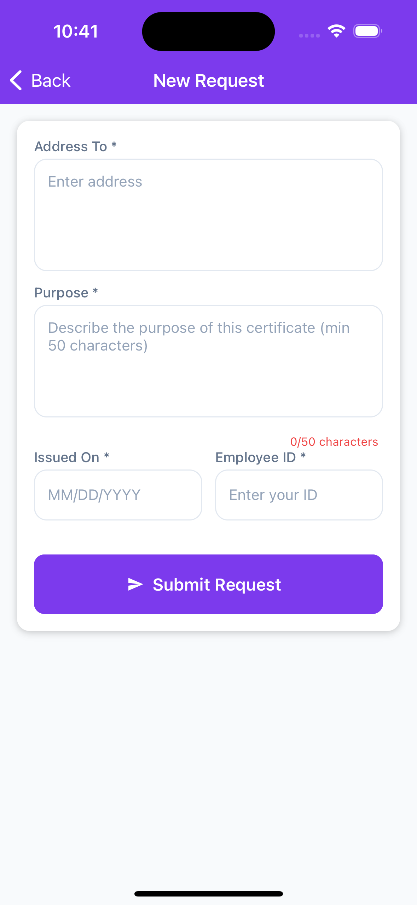 | 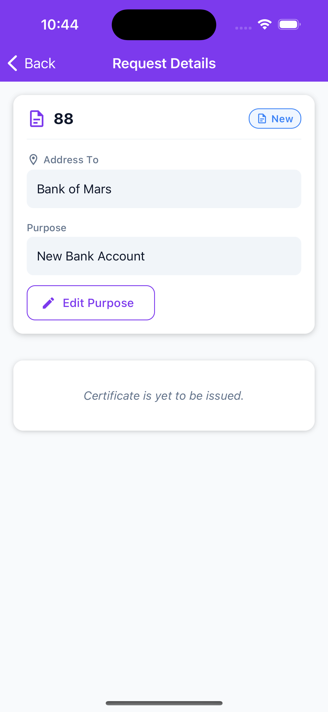 | 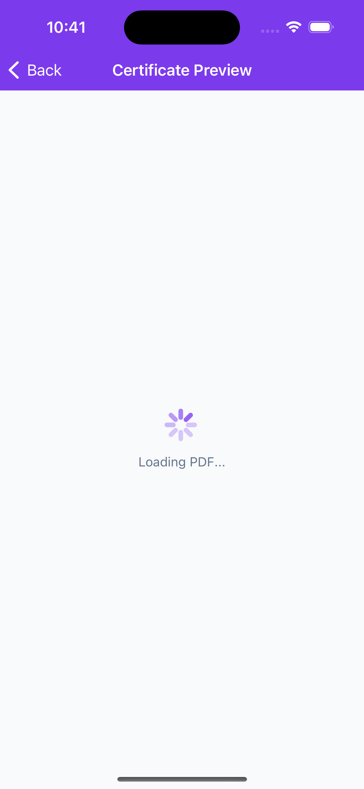 |

|                Details with Certificate                |
| :----------------------------------------------------: |
|  |

### iOS — Dark Theme

|                Requests List                 |                   New Request                    |                     Request Details                      |
| :------------------------------------------: | :----------------------------------------------: | :------------------------------------------------------: |
| 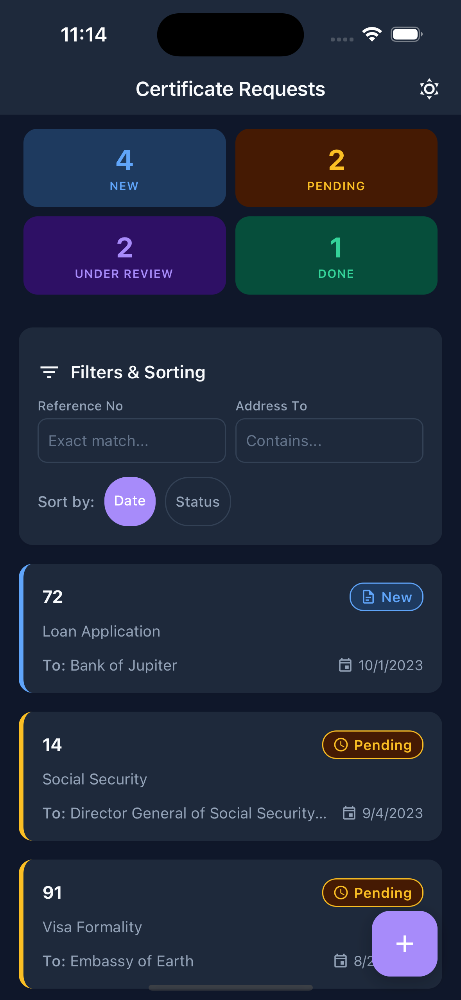 | 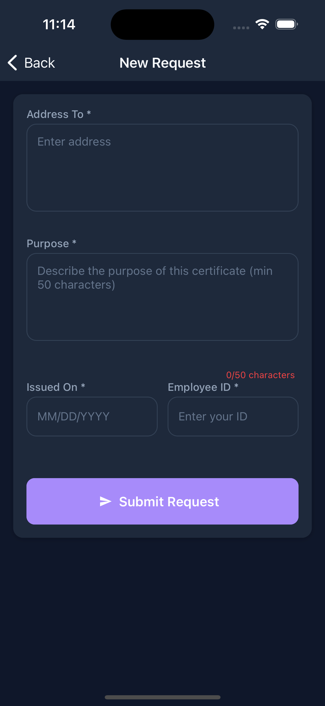 | 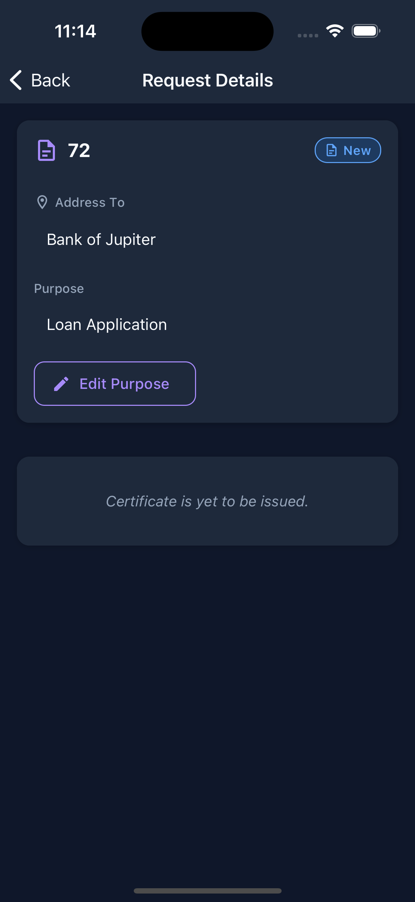 |

|                Details with Certificate                |
| :----------------------------------------------------: |
| 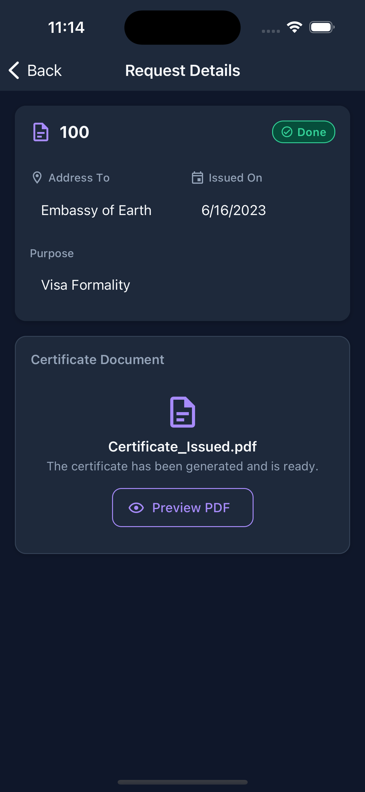 |

## Node.js Version

```
Node.js >= 20.x
```

## Dependencies

| Category         | Library                                   |
| ---------------- | ----------------------------------------- |
| Framework        | React Native CLI 0.84                     |
| Language         | TypeScript                                |
| UI Library       | React Native Paper                        |
| Navigation       | React Navigation v7 (native-stack)        |
| State Management | Redux Toolkit + React Redux               |
| Networking       | Axios                                     |
| Storage          | @react-native-async-storage/async-storage |
| PDF Viewer       | react-native-pdf                          |
| Icons            | react-native-vector-icons                 |
| Date Picker      | @react-native-community/datetimepicker    |
| Config           | react-native-config                       |
| Testing          | Jest                                      |
| Linting          | ESLint + Prettier + Husky + lint-staged   |

## Environment Setup

This project uses `react-native-config` to load environment variables from `.env` files.

Create a `.env` file in the project root:

```env
API_BASE_URL=https://zalexinc.azure-api.net
API_KEY=your_subscription_key_here
```

> **Important**: Do NOT hardcode API keys or secrets in source code. The `.env` file is listed in `.gitignore` and should never be committed.

The app reads these values via:

```typescript
import Config from 'react-native-config';

const baseURL = Config.API_BASE_URL;
const apiKey = Config.API_KEY;
```

## Running the Project

### Prerequisites

Ensure you have completed the [React Native environment setup](https://reactnative.dev/docs/set-up-your-environment).

### Install Dependencies

```sh
npm install
```

### Android

```sh
# Start Metro bundler
npm start

# In a separate terminal, build and run
npm run android
```

### iOS

```sh
# Install CocoaPods dependencies
cd ios && pod install && cd ..

# Start Metro bundler
npm start

# In a separate terminal, build and run
npm run ios
```

## Architecture Overview

The project follows a **feature-based architecture** with Redux Toolkit for state management. Each feature is self-contained within its own directory under `src/features/`, encapsulating its screens, components, Redux slices, services, validation logic, and types. Shared utilities, components, theme tokens, and constants live under `src/shared/`.

This separation ensures clear ownership of features, making the codebase scalable and easier to test. State flows predictably through Redux: UI components dispatch actions to slices, async operations are handled via `createAsyncThunk`, and the service layer abstracts all API communication through Axios. Navigation is managed centrally in `src/navigation/` using React Navigation's native-stack navigator.

### Folder Structure

```
src/
  app/
    store.ts              # Redux store configuration
    rootReducer.ts        # Combined reducers
  features/
    certificate/
      components/         # Feature-specific UI components
      screens/            # Screen components
      hooks/              # Custom hooks (useRequests, useRequestFilters)
      redux/
        slice.ts          # Redux Toolkit slice (actions + reducers)
      services/           # API service layer
        types.ts          # TypeScript interfaces
      helpers/            # Filter/sort logic
      utils/              # Validation, common types
  navigation/
    AppNavigator.tsx      # Stack navigator with theme toggle
  shared/
    components/           # Reusable components (ThemedTextInput, SuccessModal, etc.)
    constants/            # String constants
    styles/               # Spacing, typography, colors, shadows tokens
    theme/                # ThemeContext, light/dark theme definitions
    utils/                # Accessibility helpers, common utilities
    types/                # Shared TypeScript types
  assets/
    sample_certificate.pdf
```

## Available Scripts

| Script              | Description                   |
| ------------------- | ----------------------------- |
| `npm start`         | Start Metro bundler           |
| `npm run android`   | Build and run on Android      |
| `npm run ios`       | Build and run on iOS          |
| `npm test`          | Run Jest test suite           |
| `npm run lint`      | Run ESLint on src/            |
| `npm run lint:fix`  | Run ESLint with auto-fix      |
| `npm run typecheck` | Run TypeScript compiler check |
| `npm run format`    | Format code with Prettier     |

## Testing

```sh
npm test
```

Tests cover:

- Validation logic (address, purpose, date, employee ID)
- Filtering and sorting logic
- Purpose edit business rules (only when status is "New")
